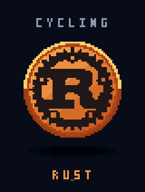

# cycling

Open-source bike computer firmware, written in Rust. Starting with the Magene C606.

The `no_std` firmware has touch and button controls, brightness, battery status,
persistent settings, idle dimming, Wi-Fi recovery and network time. It uses verified
2 MiB PSRAM and reserved flash regions for settings and rides.

Ride features include a deterministic demo, live recording with GPS/battery fields, recovery
after reset, recent ride history, and USB raw/JSON export with GPX for recorded
location tracks. Live speed and distance are still unavailable. BLE scan, GATT echo
and a laptop HRS/CSC sensor simulator have been tested; continuous sensor acquisition,
GNSS transport hardening and SD/MMC storage remain follow-ups.

[Ride recording and export](docs/ride-recording.md) ·
[Device testing tools](docs/device-debugging.md) ·
[Development progress](docs/overnight-plan.md)

The initial renderer demo:



```sh
mise install
mise run setup
mise run build
```

- [`packages/os`](packages/os) — firmware
- [`packages/stock/magene-c606`](packages/stock/magene-c606) — hardware research and analysis tools
- [`docs`](docs) — development and device testing

[Development](docs/development.md) · [Device workflow](docs/device.md) · [MIT license](LICENSE)
